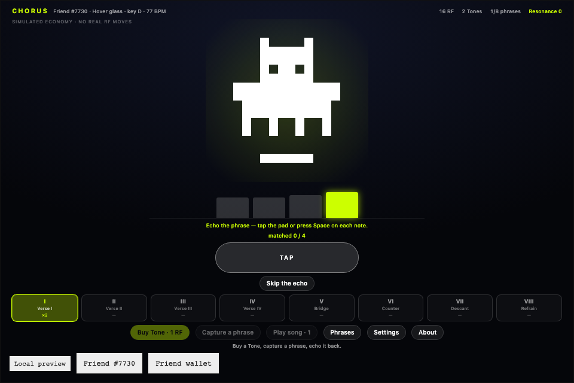
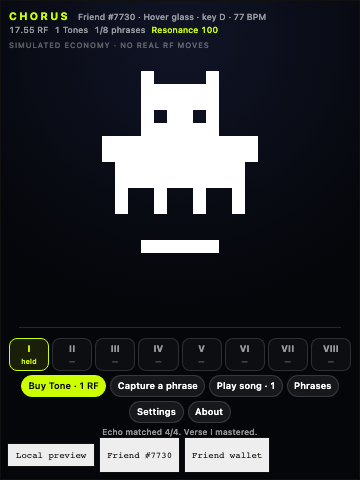

# Chorus



*Friend #7730 from the SDK's automated test fixture. Its on-chain family (5,
Hoverer) and seed (7730) compose the "Hover glass" voice in D at 77 BPM. The bars
are the phrase's notes drawn at pitch; the lit one is sounding now.*

**Project name**

Chorus

**Builder / contact**

Auri — X [@auri_0x](https://x.com/auri_0x) · GitHub [@0xNad](https://github.com/0xNad)

**Category**

**Character Spotlight.** Also relevant to Economy Potential. No Token Activity
claim is made: the economy is simulated and nothing is burned or spent on chain.

**One sentence**

Chorus composes a unique piece of music from your Rare Friend's own on-chain
identity — `familyOf(tokenId)` picks the instrument and scale, `seedOf(tokenId)`
sets the key, tempo and every note — then sells it back to you one phrase at a
time for simulated $RAREFRIENDS, where keeping a phrase makes it audible and
redeeming it returns the RF and silences it.

**What did you build?**

Every other way of putting a Generations NFT at the centre of an experience shows
it to you. Chorus lets you *hear* it. The same on-chain values that draw the
sprite also determine a song that belongs to that token and no other: nine
families map to nine instrument voices and scales, and the uint32 art seed fixes
the key, tempo and a motif that recurs across eight phrases so they cohere as one
piece rather than eight unrelated runs of notes.

You buy **Tones** with simulated RF and capture the song a phrase at a time. A
captured phrase plays, then you may **echo** it — tap the pad or press Space on
each note — which feeds a non-financial Resonance score and nothing else. **Play
song** performs every phrase you currently hold. Hold all eight and you hear the
complete piece.

The economic decision is what you do with a phrase you own. **Holding it keeps it
audible in your song. Redeeming it returns its simulated RF and removes it from
the arrangement.** Completing the song therefore means choosing not to cash out,
which is a reason to leave RF committed that does not rely on a promise of future
yield. Duplicates are not waste either: a second and third copy thicken a phrase
with extra octave layers, so you can redeem the spares and keep the phrase.

**How does it use Rare Friends?**

The selected Generations NFT is the instrument. FriendSDK verifies fresh ownership
before play; Chorus reads the Friend's family, art seed and canonical sprite
through the SDK's public, wallet-free artwork APIs.

| On-chain value | What it determines |
| --- | --- |
| `familyOf(tokenId)` | Instrument voice, waveform and musical scale — 9 families, 9 voices |
| `seedOf(tokenId)` | Key, tempo and every note of all eight phrases |
| `frames(family, seed)` | The canonical 16×16 sprite, drawn unmodified at an integer scale |

Across 27,000 generated family/seed combinations the composer produced 27,000
distinct songs. The Friend's traits change **only what the music sounds like** —
never the odds, never a reward, never the published terms, which are global and
fixed for every player.

This also answers the SDK's no-persistence constraint rather than working around
it: because the song is a pure function of chain data, it is recomputed identically
every session on any device, with nothing saved anywhere.

**Source repository**

[0xNad/chorus-rarefriends](https://github.com/0xNad/chorus-rarefriends) — public,
with setup and run instructions in its README.

Uses **FriendSDK v0.1.2**, React 19, TypeScript and Web Audio. The SDK is not
published to npm, so the v0.1.2 archive is vendored in `vendor/` and resolved by
`npm install`, which keeps the repository self-contained and reproducible.

```sh
npm install
npm run dev        # or: npm run dev:lan   to play from a phone
```

**Playable preview**

**https://0xnad.github.io/chorus-rarefriends/**

Requires a browser wallet on **Robinhood mainnet (chain 4663)** holding a
hardwired Generations NFT of **generation 1 or higher**. The SDK runtime supplies
wallet connection, Friend selection and the fresh ownership check; Chorus
implements none of those itself. No transaction is ever signed and no RF moves —
purchases, balances and rewards are simulated, and the frame carries the SDK's own
"Local preview" label for `mode === "preview"`.

Deployed to GitHub Pages from the repository's own workflow. It deploys no
contracts and signs nothing.

**How to use it**

1. **Buy Tone** — 1 simulated RF, confirmed in the SDK's trusted frame.
2. **Capture a phrase** — spends the Tone, draws one phrase from the table below,
   and plays it.
3. **Echo it** — tap the pad or press **Space** once per note, within ±160 ms.
   Optional; **Skip the echo** resolves immediately. It cannot change which phrase
   you drew or what it is worth.
4. **Play song** — performs every phrase you hold, in order.
5. **Phrases** — redeem a phrase for its RF, which removes it from the song.

Controls are touch and keyboard. There is no character movement.

### Costs, probabilities and consumable rules

Simulated. One consumable, one published outcome table.

- **Consumable:** Tone — **1.00 RF**
- **Expected reward:** **0.90 RF** per Tone (10% edge, matching the SDK's fishing reference)
- **Maximum prize:** 7.00 RF — every purchased Tone reserves this much backing

| # | Phrase | Chance | Redeem value |
| --- | --- | --- | --- |
| I | Verse I | 19.00% | 0.55 RF |
| II | Verse II | 18.00% | 0.55 RF |
| III | Verse III | 17.00% | 0.60 RF |
| IV | Verse IV | 15.00% | 0.65 RF |
| V | Bridge | 13.00% | 0.90 RF |
| VI | Counter | 10.00% | 1.20 RF |
| VII | Descant | 6.00% | 2.00 RF |
| VIII | Refrain | 2.00% | 7.00 RF |

Chances total 10000 basis points. Every purchased consumable reserves its maximum
prize; kept phrases retain their RF backing with no redemption expiry. RF amounts
are bigint base units (1 RF = 10^18). Resonance and phrase mastery are
non-financial and carry no RF value or redemption promise.

**Accessibility**

Chorus is **fully playable with sound off**: every note is also a bar on the note
ribbon and a pulse on the Friend, and the echo scores identically muted because
its timing comes from the composition rather than the audio clock. Mute and
reduced-motion controls are in Settings, `prefers-reduced-motion` is honoured, the
game is keyboard operable with visible focus, and loading, error and retry states
cover both the session and the artwork read. On narrow screens `host.css` switches
the trusted frame to a portrait layout, so a phone gets a usable frame instead of
a 240 px-tall strip.



**Checks**

| Check | Result |
| --- | --- |
| `friendsdk check` | valid; expected reward 0.9 RF, maximum 7 RF |
| Browser check @ 960 px | pass |
| Browser check @ 360 px | pass |
| Echo scoring played in time | 4/4 matched, phrase mastered |
| FriendSDK `npm test` (v0.1.2 checkout) | 116 tests, 114 pass, 0 fail, 2 skipped |
| `tsc --noEmit` | clean |
| Pages deploy | succeeded; preview boots with the ownership gate and no console errors |

The browser check (`npm run verify`) drives the real runtime in headless Chromium
with the SDK's read-only wallet/RPC fixtures, asserting that the canonical artwork
resolves, the composed voice matches the fixture Friend, buy → capture → hold
works, the capture and play controls stay locked while a phrase is playing, the
echo masters the phrase when played on the composed cadence, Resonance rises
without touching the ledger, redeeming releases the phrase, and the mute and
reduced-motion controls work. Mocks are confined to that automated check; `dev`
and `build` keep the real ownership gate.

The 2 skipped SDK tests are the local contract integration tests, which the SDK
skips when Foundry is unavailable.

**Known issues and limitations**

- **Not yet verified with a real wallet.** Everything above was verified through
  the SDK's automated fixtures and by loading the deployed preview, which reaches
  and renders the genuine ownership gate. A playtest by an eligible Friend holder
  has not been done yet, so real-wallet Friend selection, live artwork reads for an
  arbitrary token, and phone wallet-browser behaviour remain unconfirmed. This will
  be exercised and the entry updated during the event.
- **No persistence.** The SDK sandbox has no storage and the bridge has no save
  API, so held phrases and Resonance last one runtime session. The song itself is
  unaffected — it is recomputed from chain data every time.
- The RF outcome is a weighted draw. Echo accuracy is presentation and a
  non-financial score; it cannot influence a reward, and the entry makes no claim
  that skill earns RF.
- The full-resonance state and the rarer phrases are not covered by the automated
  check, because the SDK fixture pins the preview roll to a single outcome. They
  were exercised by hand.
- Audio requires a user gesture, per browser autoplay rules. If a browser refuses
  an AudioContext the game keeps working silently and the ribbon still shows every
  note.
- Live on-chain play is not implemented and no contracts were deployed. Moving to
  live play would need the chance-game economy actions the SDK already defines,
  plus a persistence story for held phrases, which v0.1.2 does not supply.

**Credits**

Character artwork is the canonical Rare Friends Generations sprite set, read from
the pinned artwork deployment and drawn unmodified at an integer scale. Music,
code, interface and the note ribbon are original work for this submission. **No
third-party audio samples** — every sound is synthesised by oscillators at runtime.
FriendSDK is Apache-2.0; the vendored archive retains its own licence and NOTICE.
